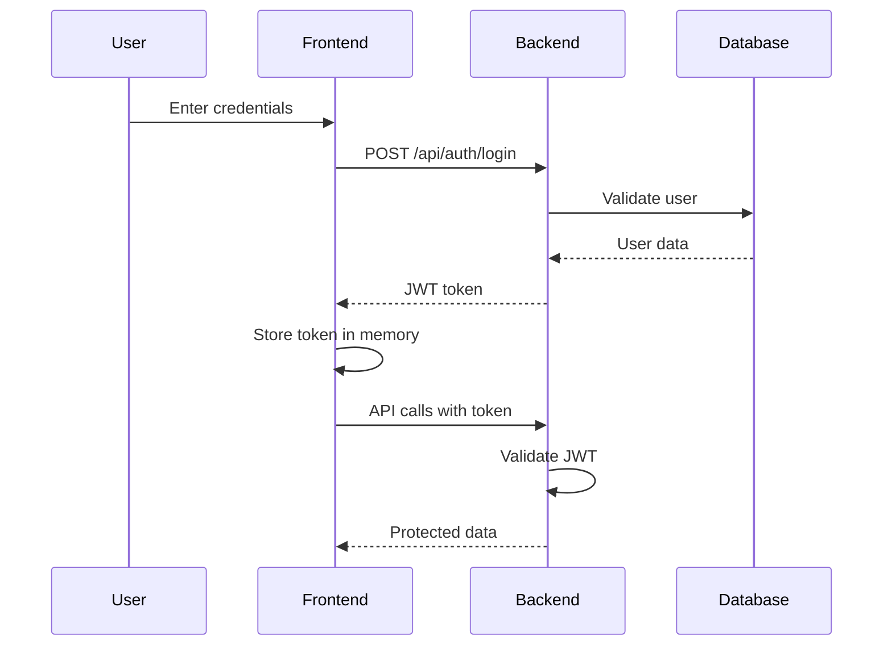

# 💬 Message Board Application

A modern, full-stack message board built with TypeScript and .NET, featuring real-time messaging, JWT authentication, and a beautiful responsive UI.

<div align="center">


</div>

---

## ✨ Features

🔐 **Secure Authentication** - JWT-based login and registration  
💬 **Real-time Messaging** - Post and view messages instantly  
🎨 **Modern UI** - Beautiful, responsive design with smooth animations  
📱 **Mobile-First** - Optimized for all screen sizes  
🛡️ **Error Handling** - Graceful fallbacks and user feedback  
⚡ **Performance** - Efficient state management and rendering

---

## 📈 Project Evolution

This project demonstrates progressive development:

- **v1.0** (main branch): Core message board functionality - extended from .NET/TypeScript template with authentication, message management, and responsive UI
- **v2.0** (spa-version branch): _In development_ - Scaling to full SPA with user dashboard, persistent sessions, and advanced user management

Each version represents different architectural decisions and development phases.

---

## 🏗️ Tech Stack

### Frontend

- **TypeScript** - Type-safe JavaScript with modern ES6+ features
- **Webpack** - Module bundling with hot reload
- **Bootstrap 5** - Responsive CSS framework
- **SCSS** - Enhanced styling with variables and mixins

### Backend

- **.NET 7+** - High-performance web API
- **Entity Framework Core** - Object-relational mapping
- **MySQL** - Reliable database storage
- **JWT Authentication** - Secure token-based auth

---

## 🚀 Quick Start

### Prerequisites

Ensure you have these installed:

| Tool     | Version | Download                                           |
| -------- | ------- | -------------------------------------------------- |
| .NET SDK | 7.0+    | [Download](https://dotnet.microsoft.com/download)  |
| Node.js  | 18.0+   | [Download](https://nodejs.org/)                    |
| MySQL    | 8.0+    | [Download](https://dev.mysql.com/downloads/mysql/) |

### 🔧 Backend Setup

1. **Navigate to the API project**

   ```bash
   cd Backend/MessageBoard.API
   ```

2. **Configure database connection**

   ```json
   // appsettings.json
   {
     "ConnectionStrings": {
       "DefaultConnection": "Server=localhost;Database=MessageBoardDB;User=root;Password=YOUR_PASSWORD;Port=3306;"
     }
   }
   ```

3. **Install EF Core tools** (if not already installed)

   ```bash
   dotnet tool install --global dotnet-ef
   ```

4. **Setup database**

   ```bash
   dotnet ef migrations add InitialCreate
   dotnet ef database update
   ```

5. **Start the API**

   ```bash
   dotnet run
   ```

   > 🌐 API will be available at `http://localhost:5285`

### 🎨 Frontend Setup

1. **Navigate to frontend directory**

   ```bash
   cd Frontend
   ```

2. **Install dependencies**

   ```bash
   npm install
   ```

3. **Start development server**

   ```bash
   npm run dev
   ```

   > 🌐 App will open at `http://localhost:3000`

4. **Build for production** (optional)
   ```bash
   npm run build
   ```

---

## 📁 Project Structure

```
MessageBoard/
├── 🔥 Backend/
│   └── MessageBoard.API/
│       ├── Controllers/         # API endpoints
│       ├── Models/              # Data models (User, Thread, Message)
│       ├── Data/                # Database context & migrations
│       └── Program.cs           # Application startup
│
└── 🎨 Frontend/
    ├── src/
    │   ├── ts/
    │   │   ├── api/             # API client & types
    │   │   ├── state/           # Application state management
    │   │   ├── app.ts           # Main application entry
    │   ├── scss/                # Styles & Bootstrap customization
    │   └── index.html           # HTML template
    ├── webpack.config.js        # Build configuration
    ├── tsconfig.json            # Typescript configuration
    └── package.json             # Dependencies & scripts
```

---

## 🔐 How Authentication Works



---

## 🎯 Available Scripts

| Command         | Description                                 |
| --------------- | ------------------------------------------- |
| `npm run dev`   | 🚀 Start development server with hot reload |
| `npm run build` | 📦 Build for production                     |
| `npm start`     | 🌐 Start dev server and open browser        |

---

## 🛠️ Development Workflow

### Adding New Features

1. **Backend Changes**

   - Add/modify models in `Models/`
   - Create migrations: `dotnet ef migrations add YourMigrationName`
   - Update database: `dotnet ef database update`
   - Add API endpoints in `Controllers/`

2. **Frontend Changes**
   - Update types in `src/api/apiClient.ts`
   - Modify state management in `src/state/AppState.ts`
   - Add UI logic in `src/app.ts`
   - Style with SCSS in `src/scss/`

### Code Organization

- **State Management**: Centralized in `AppState` class
- **API Communication**: Handled by `apiClient` with automatic JWT injection
- **UI Updates**: Reactive updates based on authentication state
- **Error Handling**: Graceful fallbacks with user-friendly messages

---

## 🐛 Troubleshooting

<details>
<summary><strong>🔴 CORS Errors</strong></summary>

**Problem**: Frontend can't connect to backend  
**Solution**: Verify backend CORS policy allows `http://localhost:3000`

</details>

<details>
<summary><strong>🔴 Database Connection Issues</strong></summary>

**Problem**: EF Core can't connect to MySQL  
**Solutions**:

- Ensure MySQL service is running
- Verify connection string credentials
- Check firewall/port settings (default: 3306)

</details>

<details>
<summary><strong>🔴 Build Failures</strong></summary>

**Problem**: Webpack or .NET build errors  
**Solutions**:

- Clear node_modules: `rm -rf node_modules && npm install`
- Clean .NET: `dotnet clean && dotnet restore`
- Check for TypeScript/C# syntax errors

</details>

<details>
<summary><strong>🔴 Authentication Issues</strong></summary>

**Problem**: Login/register not working  
**Solutions**:

- Check browser console for errors
- Verify API endpoints are responding
- Ensure database has proper user table structure

</details>

---

## 🚀 Deployment Ready

This application is designed to be easily deployable:

- **Frontend**: Static files ready for CDN or web server
- **Backend**: Self-contained .NET application
- **Database**: Standard MySQL compatible with cloud providers

### Recommended Hosting Options

| Component | Platform Options                   |
| --------- | ---------------------------------- |
| Frontend  | Netlify, Vercel, GitHub Pages      |
| Backend   | Azure App Service, Heroku, Railway |
| Database  | PlanetScale, Azure MySQL, AWS RDS  |

---

## 🎯 Roadmap

### 🔄 Upcoming Features

- [ ] **Multi-thread Support** - Create and manage multiple conversation threads
- [ ] **Message Reactions** - Like, dislike, and emoji reactions
- [ ] **User Profiles** - Avatar uploads and profile customization
- [ ] **Real-time Updates** - WebSocket integration for live messaging
- [ ] **Message Search** - Full-text search across all messages
- [ ] **Admin Panel** - User management and moderation tools

### 🔧 Technical Improvements

- [ ] **Persistent Sessions** - Secure token storage
- [ ] **Message Pagination** - Handle large message datasets
- [ ] **Image Uploads** - File attachment support
- [ ] **Unit Testing** - Comprehensive test coverage
- [ ] **Docker Support** - Containerized deployment
- [ ] **API Documentation** - Swagger/OpenAPI integration

---

## 🤝 Contributing

We welcome contributions! Here's how to get started:

1. **Fork** the repository
2. **Create** a feature branch (`git checkout -b feature/amazing-feature`)
3. **Commit** your changes (`git commit -m 'Add amazing feature'`)
4. **Push** to the branch (`git push origin feature/amazing-feature`)
5. **Open** a Pull Request

### Development Guidelines

- Follow existing code style and patterns
- Add comments for complex logic
- Update documentation for new features
- Test your changes thoroughly

---

## 📄 License

This project is licensed under the MIT License - see the [LICENSE](LICENSE) file for details.

---

## 🙏 Acknowledgments

- **Bootstrap Team** - For the excellent CSS framework
- **Microsoft** - For .NET and TypeScript
- **MySQL Team** - For the reliable database system
- **Webpack Community** - For the powerful build tools

---

<div align="center">

**⭐ Star this repo if you found it helpful! ⭐**

Made with ❤️ by developers, for developers

</div>
